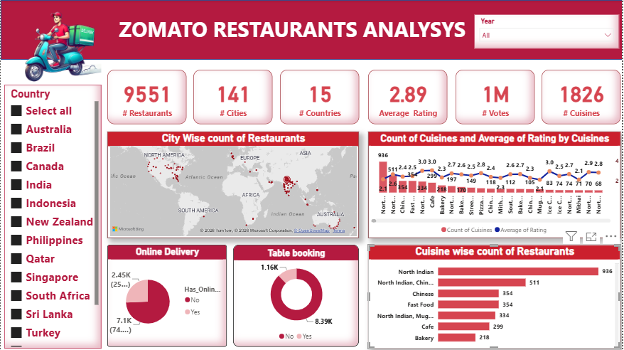
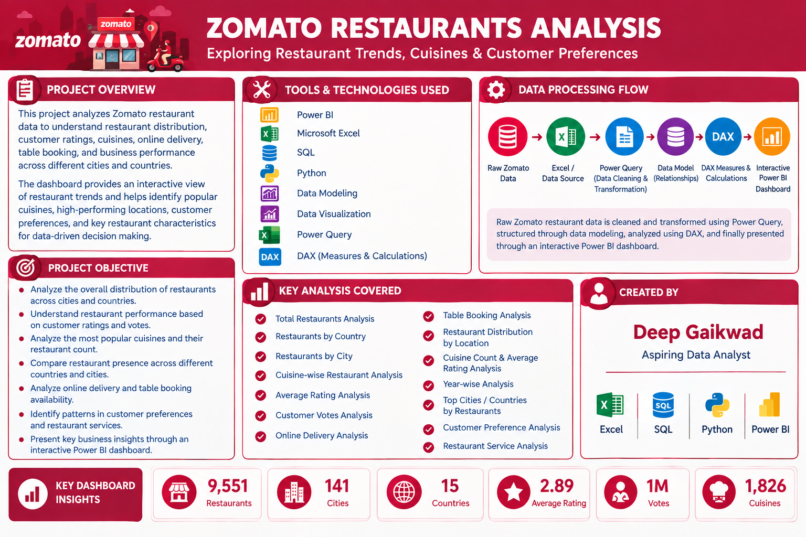

# 🍽️ Zomato Restaurants Analysis | Power BI

## 📊 Project Overview

This project is an interactive **Zomato Restaurants Analysis Dashboard** developed using **Microsoft Power BI**.

The dashboard analyzes restaurant data across different countries and cities to understand restaurant distribution, cuisine popularity, customer ratings, votes, online delivery availability, and table booking trends.

The objective is to transform restaurant data into meaningful business insights through interactive data visualization.

---

## 🎯 Project Objectives

- Analyze restaurant distribution across countries and cities
- Understand cuisine-wise restaurant performance
- Analyze average customer ratings
- Analyze customer votes
- Compare restaurant counts across cities
- Analyze online delivery availability
- Analyze table booking availability
- Identify popular cuisines
- Present insights through an interactive dashboard

---

## 🛠️ Tools & Technologies

- Microsoft Power BI
- Power Query
- DAX
- Microsoft Excel
- Data Cleaning
- Data Transformation
- Data Modeling
- Data Visualization
- Interactive Dashboard Design

---

## 📌 Key KPIs

- 🍽️ Total Restaurants
- 🏙️ Total Cities
- 🌍 Total Countries
- ⭐ Average Rating
- 👍 Total Votes
- 🍴 Total Cuisines

---

## 📈 Dashboard Features

- Country-wise Restaurant Analysis
- City-wise Restaurant Count
- Cuisine-wise Restaurant Analysis
- Cuisine Count & Average Rating
- Online Delivery Analysis
- Table Booking Analysis
- Customer Rating Analysis
- Customer Votes Analysis
- Interactive Year Filter
- Interactive Country Filter
- KPI Cards
- Map Visualization
- Charts and Graphs

---

## 📊 Dashboard Insights

The dashboard provides an interactive view of restaurant data and helps identify:

- Distribution of restaurants across different countries
- Cities with higher numbers of restaurants
- Most common and popular cuisines
- Cuisine-wise average ratings
- Customer engagement through votes
- Availability of online delivery
- Availability of table booking
- Restaurant and cuisine trends

---

## 🖼️ Dashboard Preview

### 🍽️ Zomato Restaurants Analysis Dashboard

### 📋 Project Information

---

## 📂 Project Files

| File / Folder | Description |
|---|---|
| `Zomato_Restaurant_Data_Analysis_Dashboard.pbix` | Power BI dashboard |
| `restaurant_data.xlsx` | Restaurant dataset |
| `countries_data.xlsx` | Country reference dataset |
| `Images/` | Dashboard and project information images |
| `Readme.md` | Project documentation |

---

## 🔄 Data Analysis Process

**Raw Data → Data Cleaning → Data Transformation → Data Modeling → DAX Calculations → Data Visualization → Interactive Dashboard**

Power Query was used for data cleaning and transformation, while Power BI was used for data modeling, calculations, visualization, and dashboard development.

---

## 🚀 How to Use

1. Download or clone this repository.
2. Open `Zomato_Restaurant_Data_Analysis_Dashboard.pbix` using Power BI Desktop.
3. If required, update the Excel data source path.
4. Refresh the data.
5. Use the available filters and slicers to explore the dashboard.

---

## 📚 Skills Demonstrated

- Power BI
- Power Query
- DAX
- Excel
- Data Cleaning
- Data Transformation
- Data Modeling
- Data Visualization
- Dashboard Development
- Business Analysis

---

## 👨‍💻 Author

**Deep Gaikwad**

🔗 GitHub: https://github.com/deep-gaikwad

🔗 LinkedIn: https://www.linkedin.com/in/deepgaikwad/

---

**Skills:**  
Excel | SQL | Python | Power BI | Data Analysis

---

## ⭐ Conclusion

Thank you for visiting this project! ⭐

⭐ If you find this project useful, feel free to star the repository!

